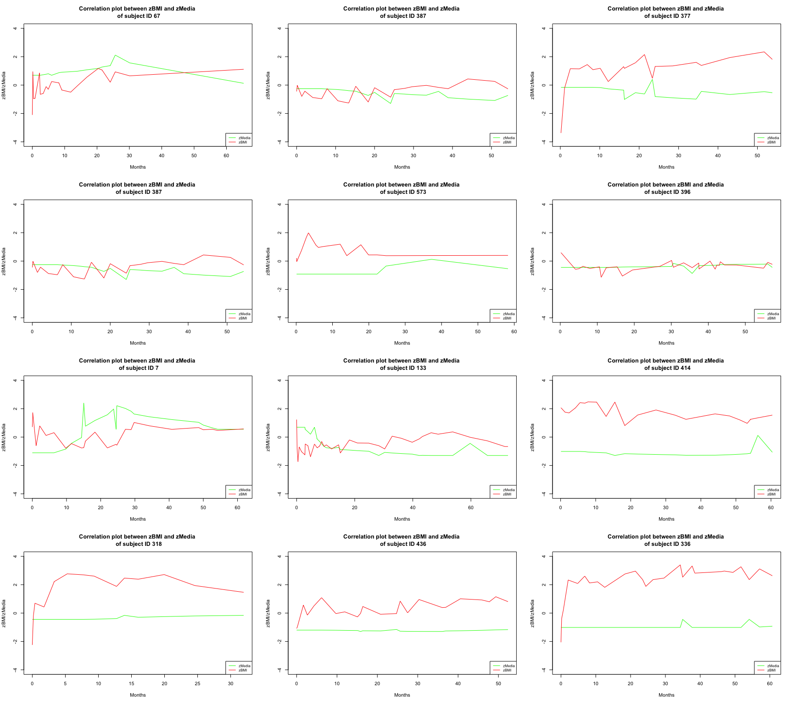
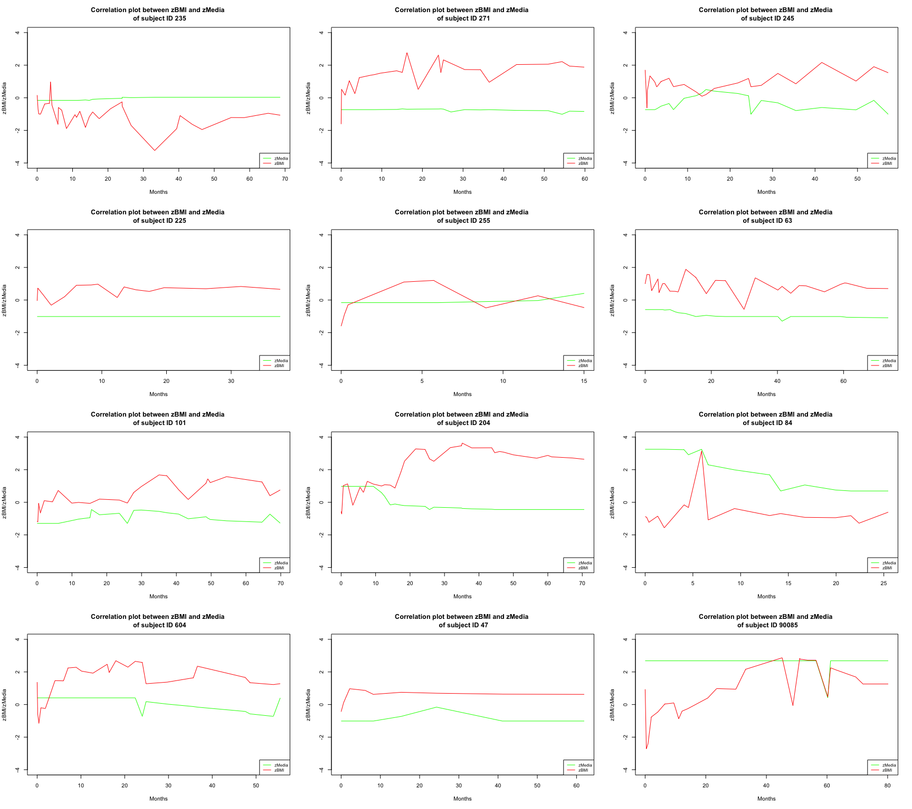
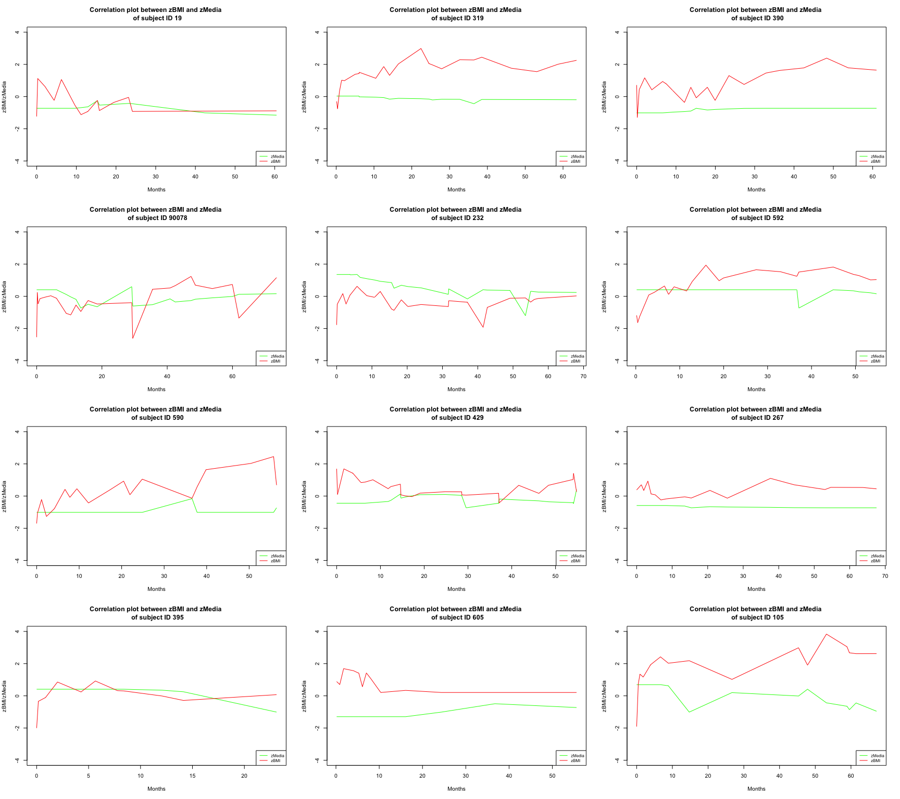
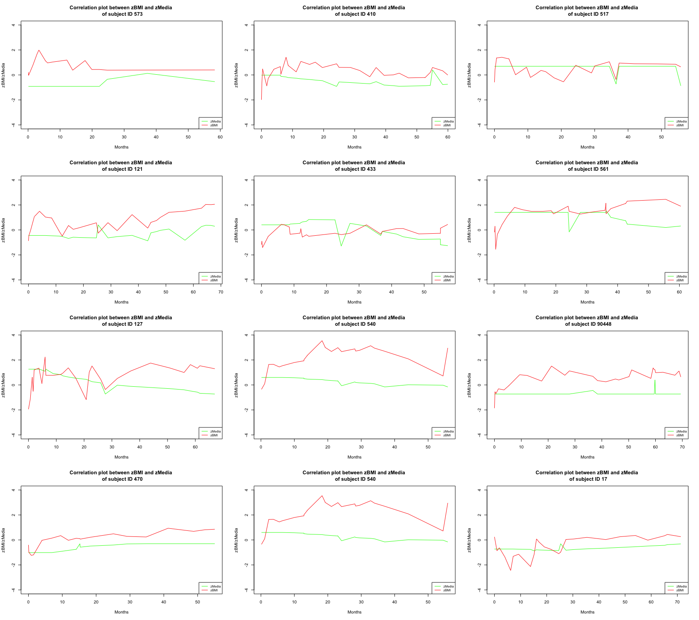
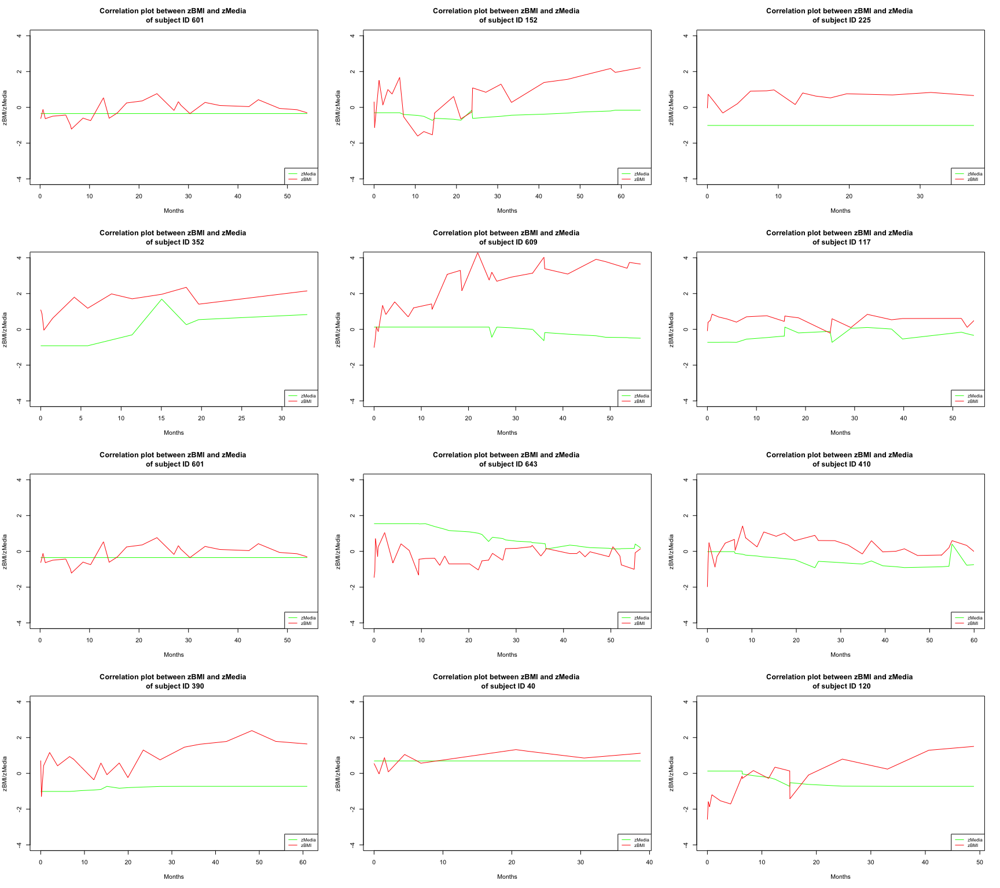

04\_Correlation Plots
================
Zarni Htet
April 11, 2018

### Introduction

The goal of this code file to learn the relationship between BMI and Media exposure by randomly selecting 12 subject IDs and plotting standardized BMI and Media exposure data across time. The random selection is repeated five more times with different seeds to get a total of 60 random subject IDs for exploration.

### Datasets Involved

The linearly interpolated final data set generated from *01a\_Linear\_Interpolation* is used here.

### Admnistration

Professor Marc Scott and Professor Daphna Harel are the supervisors of this project. The data is from the Belle Lab at the Bellevue Hospital. Additional background on the project is in the *README* at the root directory of the Github repository associated with the project.

#### R Libraries

This block has all the *required* libraries for this code file.

``` r
library(rio) #for importing datasets
```

#### Importing dataset

``` r
bmi_media <- import("../../data/final/final_interp_data.csv")
```

#### Standardizing Media values

As the BMI value has already been standardized, only the Media needs to be z-standardized.

``` r
bmi_media$zMedia <- scale(bmi_media$Media, center = TRUE, scale = TRUE)
```

#### First 12 Random Subject IDs correlation plots

``` r
#Randomly draw 12 subject IDs
set.seed(1234)
subjects <- sample(bmi_media$ID, size = 12, replace = FALSE)
```

``` r
#Loop through to create 12 plots
par(mfrow=c(4,3))
  for (i in subjects){
    df <- bmi_media[bmi_media$ID == i,]
    plot(df$Months, df$zMedia, type = "l", main = paste("Correlation plot between zBMI and zMedia \n of subject ID", i), xlab = "Months", ylab = "zBMI/zMedia", col = "green", ylim = c(-4,4))
lines(df$Months, df$zBMI, col = "red")
legend("bottomright", legend = c("zMedia", "zBMI"), col = c("green", "red"), lty = 1, cex = 0.75)
  }
```



#### Second 12 Random Subject IDs correlation plots

``` r
#Randomly draw 12 subject IDs
set.seed(5678)
subjects <- sample(bmi_media$ID, size = 12, replace = FALSE)
```

``` r
#Loop through to create 12 plots
par(mfrow=c(4,3))
  for (i in subjects){
    df <- bmi_media[bmi_media$ID == i,]
    plot(df$Months, df$zMedia, type = "l", main = paste("Correlation plot between zBMI and zMedia \n of subject ID", i), xlab = "Months", ylab = "zBMI/zMedia", col = "green", ylim = c(-4,4))
lines(df$Months, df$zBMI, col = "red")
legend("bottomright", legend = c("zMedia", "zBMI"), col = c("green", "red"), lty = 1, cex = 0.75)
  }
```



#### Third 12 Random Subject IDs correlation plots

``` r
#Randomly draw 12 subject IDs
set.seed(7777)
subjects <- sample(bmi_media$ID, size = 12, replace = FALSE)
```

``` r
#Loop through to create 12 plots
par(mfrow=c(4,3))
  for (i in subjects){
    df <- bmi_media[bmi_media$ID == i,]
    plot(df$Months, df$zMedia, type = "l", main = paste("Correlation plot between zBMI and zMedia \n of subject ID", i), xlab = "Months", ylab = "zBMI/zMedia", col = "green", ylim = c(-4,4))
lines(df$Months, df$zBMI, col = "red")
legend("bottomright", legend = c("zMedia", "zBMI"), col = c("green", "red"), lty = 1, cex = 0.75)
  }
```



#### Fourth 12 Random Subject IDs correlation plots

``` r
#Randomly draw 12 subject IDs
set.seed(9999)
subjects <- sample(bmi_media$ID, size = 12, replace = FALSE)
```

``` r
#Loop through to create 12 plots
par(mfrow=c(4,3))
  for (i in subjects){
    df <- bmi_media[bmi_media$ID == i,]
    plot(df$Months, df$zMedia, type = "l", main = paste("Correlation plot between zBMI and zMedia \n of subject ID", i), xlab = "Months", ylab = "zBMI/zMedia", col = "green", ylim = c(-4,4))
lines(df$Months, df$zBMI, col = "red")
legend("bottomright", legend = c("zMedia", "zBMI"), col = c("green", "red"), lty = 1, cex = 0.75)
  }
```



#### Fifth 12 Random Subject IDs correlation plots

``` r
#Randomly draw 12 subject IDs
set.seed(0000)
subjects <- sample(bmi_media$ID, size = 12, replace = FALSE)
```

``` r
#Loop through to create 12 plots
par(mfrow=c(4,3))
  for (i in subjects){
    df <- bmi_media[bmi_media$ID == i,]
    plot(df$Months, df$zMedia, type = "l", main = paste("Correlation plot between zBMI and zMedia \n of subject ID", i), xlab = "Months", ylab = "zBMI/zMedia", col = "green", ylim = c(-4,4))
lines(df$Months, df$zBMI, col = "red")
legend("bottomright", legend = c("zMedia", "zBMI"), col = c("green", "red"), lty = 1, cex = 0.75)
  }
```



#### Sixth 12 Random Subject IDs correlation plots

``` r
#Randomly draw 12 subject IDs
set.seed(0000)
subjects <- sample(bmi_media$ID, size = 12, replace = FALSE)
```

``` r
#Loop through to create 12 plots
par(mfrow=c(4,3))
  for (i in subjects){
    df <- bmi_media[bmi_media$ID == i,]
    plot(df$Months, df$zMedia, type = "l", main = paste("Correlation plot between zBMI and zMedia \n of subject ID", i), xlab = "Months", ylab = "zBMI/zMedia", col = "green", ylim = c(-4,4))
lines(df$Months, df$zBMI, col = "red")
legend("bottomright", legend = c("zMedia", "zBMI"), col = c("green", "red"), lty = 1, cex = 0.75)
  }
```


